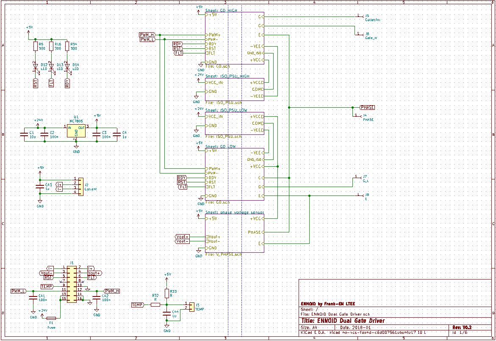
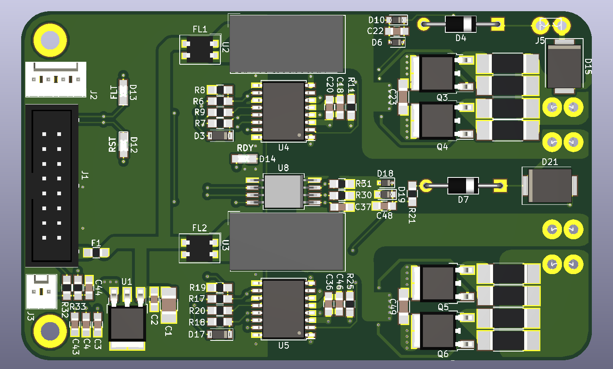
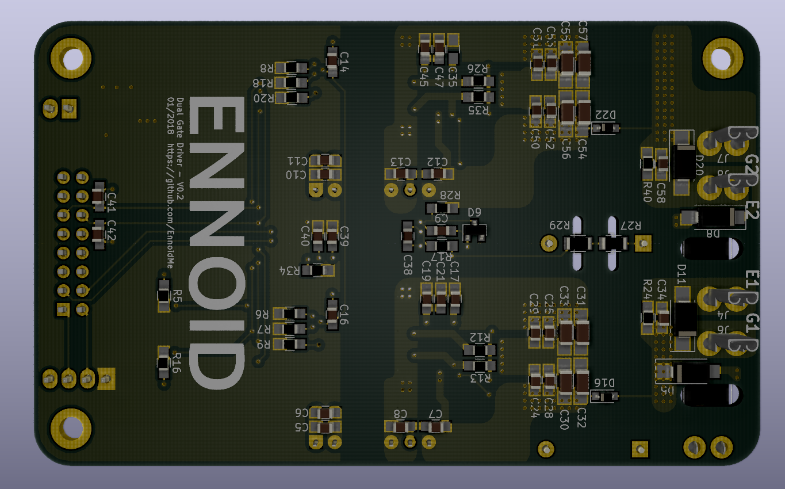
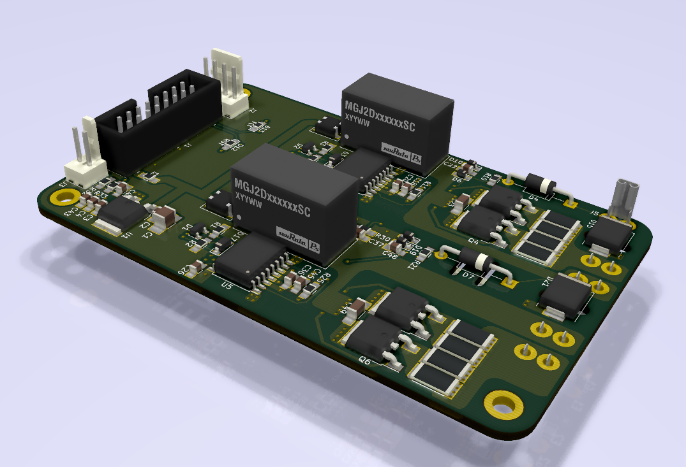

This repository is part of the open-source project: **EVGE - Electric Vehicle Global Equipment**. 
It includes the development of the following components:

- EVSE - Electric Vehicle Supply Equipment (Available on the market)
- EVCE - Electric Vehicle Charge Equipment (To do)
- EVBE - Electric Vehicle Battery Equipment ( In development)
	- Battery Pack
	- Master BMS
	- Slave BMS

**- EVPE - Electric Vehicle Powertrain Equipment (in progress)**
	- Motor Driver (Testing in progress - Based on the work from Benjamin Vedder & Marcos from Paltatech)

	**- Gate driver (Testing in progress - ENNOID)**
	- Three-Phase Electric Motor (Testing in progress with ENNOID's design)

# ENNOID - Dual Gate Driver

The "Dual Gate Driver" is a sub-component of the **EVPE project** and can be directly connected to this control board:

https://github.com/paltatech/VESC-controller

The driver is pin compatible with several power modules such as the ones listed below:

- http://www.mitsubishielectric.com/semiconductors/content/product/powermod/powmod/igbtmod/tgatef/cm300du-12f_e.pdf
- https://www.wolfspeed.com/cas120m12bm2

## V0.1 (untested & archived):

V0.1 is based upon the design from wolfspeed two-channel gate driver for 1200V SiC MOSFET power modules
- https://www.wolfspeed.com/cgd15hb62p1

Feature:

- Dual gate driver
- 2W Isolated power supply / gate
- Direct mount low inductance design
- Short circuit protection
- Under voltage protection

Changes from the original wolfspeed design:

- Added Voltage sense circuit (Experimental)
- 98 x 60 mm 2 layer PCB made with Kicad
- Current sensor connector
- Temperature sensor circuit & connector
- Minimum SMD 0805 components size for easy handsoldering
- 2x8 (16) pins headers for easy connection with VESC board

## V0.2:

V0.2 is based upon the design from tiduc70a.pdf.

- http://www.ti.com/lit/ug/tiduc70a/tiduc70a.pdf

Changes from V0.1 include:

- BJT based powerstage instead of mosfet IC IXD-609
- Adjustable soft turnoff feature
- SMD gate resistor instead of MELF
- Active clamping / Over voltage protection
- Shoot trough EMI protection on PWM input

BOM link for 3 boards at Mouser below : 
- https://www.mouser.com/ProjectManager/ProjectDetail.aspx?AccessID=f6574b98ce

### Schematics

### Top View

### Bottom View

### Board View

