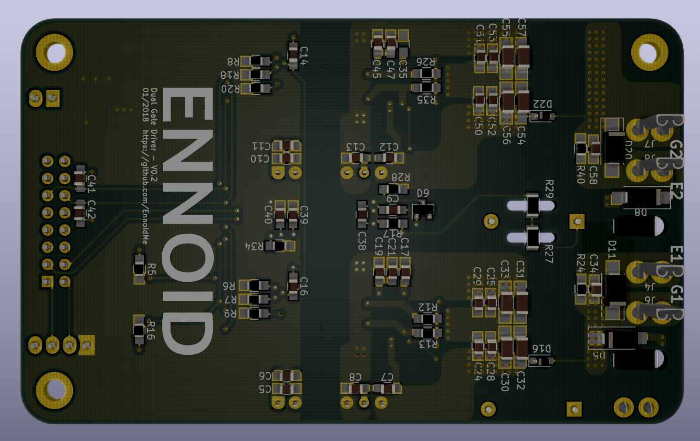

This repository is part of the open-source project: **EVPE - Electric Vehicle Powertrain Equipment**. 
The **EVPE** project includes the development of the following components:

- Battery Pack architecture (To do)
- Battery management system (To do - Will be based on the work from Danny Bokma - DieBieMS)
- Motor driver (Work in progress - Based on the work from Benjamin Vedder & Marcos from Paltatech)
- On-board charger (To do)
- Three-phase electric motor (Testing ENNOID's design)

# ENNOID - Dual Gate Driver

The goal of this repository is to create an open source half-brige gate driver for IGBT or Mosfet power stage. The driver is pin compatible with modules such as the ones listed below:

- http://www.mitsubishielectric.com/semiconductors/content/product/powermod/powmod/igbtmod/tgatef/cm300du-12f_e.pdf
- https://www.wolfspeed.com/cas120m12bm2

The "Dual Gate Driver" is a sub-component of the **EVPE project - Motor driver** and can be directly connected to this control board:

https://github.com/paltatech/VESC-controller

## V0.1 (untested & archived):

V0.1 is based upon the design of the wolfspeed two-channel gate driver for 1200V SiC MOSFET power modules
- https://www.wolfspeed.com/cgd15hb62p1

Feature:

- Dual gate driver
- 2W Isolated power supply / gate
- Direct mount low inductance design
- Short circuit protection
- Under voltage protection

Changes from the original wolfspeed design:

- Added Voltage sense circuit (Experimental)
- 98 x 60 mm 2 layer PCB made with Kicad
- Current sensor connector
- Temperature sensor circuit & connector
- Minimum SMD 0805 components size for easy handsoldering
- 2x8 (16) pins headers for easy connection with VESC board

## V0.2:

V0.2 is based upon the design from tiduc70a.pdf.

- http://www.ti.com/lit/ug/tiduc70a/tiduc70a.pdf

Changes from V0.1 include:

- BJT based powerstage instead of mosfet IC IXD-609
- Adjustable soft turnoff feature
- SMD gate resistor instead of MELF
- Active clamping / Over voltage protection
- Shoot trough EMI protection on PWM input

BOM link for 3 boards at Mouser below : 
- https://www.mouser.com/ProjectManager/ProjectDetail.aspx?AccessID=f6574b98ce

### Schematics

### Top View

### Bottom View

### Board View

