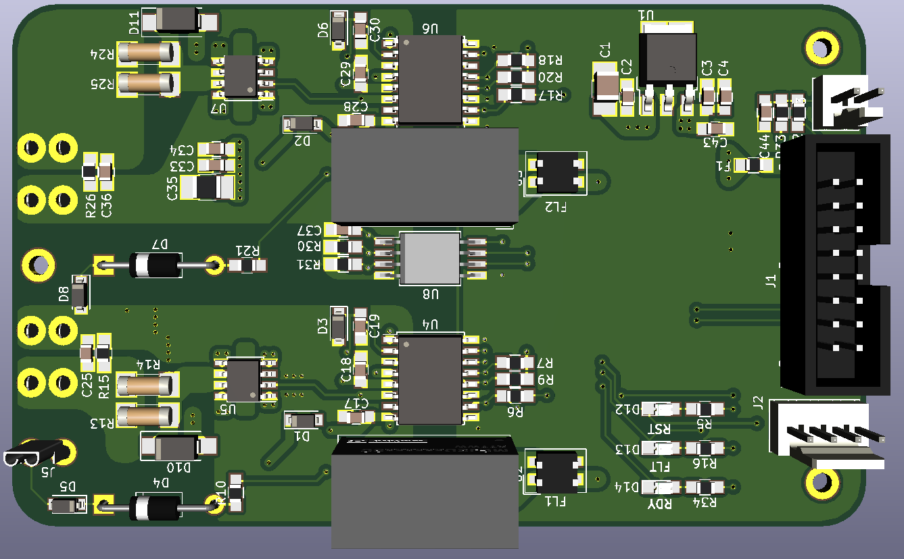

# ENNOID - Dual Gate Driver

The goal of this project is to create an open source H-bridge gate driver design for IGBT or Mosfet modules "bricks" like those:

- https://www.wolfspeed.com/cas120m12bm2
- http://www.pwrx.com/pwrx/docs/cm300du-12f.pdf

The design could be adapted for different modules after testing.

The goal is to adapt the "Dual Gate Driver" with this control board:

https://github.com/paltatech/VESC-controller

