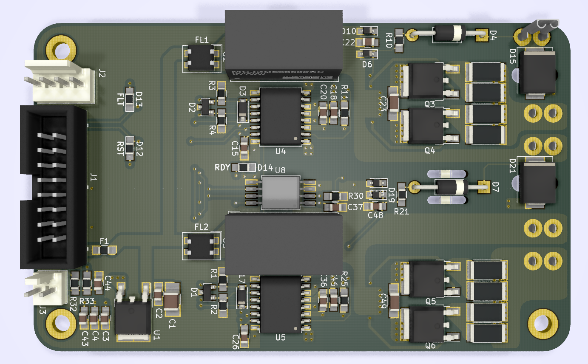
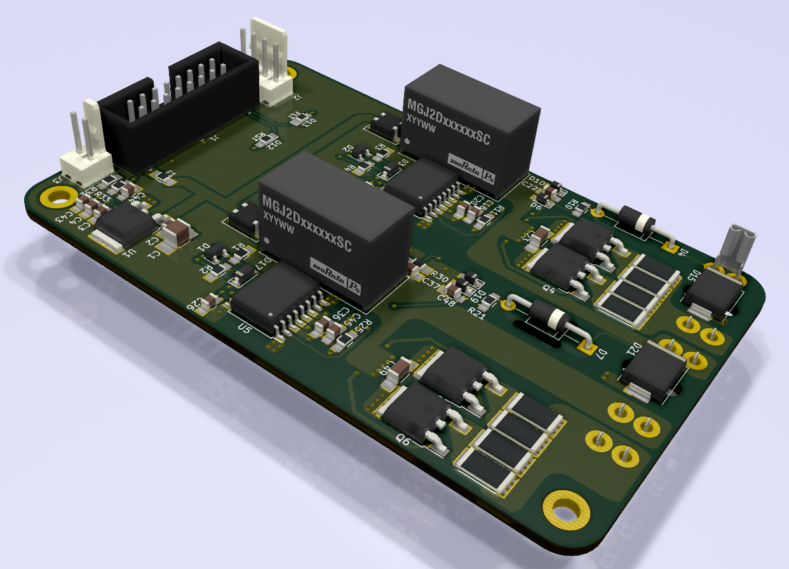

# ENNOID - Dual Gate Driver

The goal of this project is to create an open source H-bridge gate driver design for IGBT or Mosfet modules "bricks" like those:

- http://www.pwrx.com/pwrx/docs/cm300du-12f.pdf
- https://www.wolfspeed.com/cas120m12bm2

The design could be adapted for different modules types after testing.

The "Dual Gate Driver" can be directly connected to this control board (No more adapter board is required):

https://github.com/paltatech/VESC-controller

## V0.1:

The V0.1 is based upon the design of the wolfspeed two-channel gate driver for 1200V SiC MOSFET power modules
- https://www.wolfspeed.com/cgd15hb62p1

Feature:

- Dual gate driver
- 2W Isolated power supply / Gate
- Direct mount low inductance design
- Short circuit protection
- Under voltage protection

Changes from the original wolfspeed design:

- Added Voltage sense circuit
- 98 x 60 mm 2 layer PCB made with Kicad
- Current sensor connector
- Temperature sensor circuit & connector
- Minimum SMD 0805 components size for easy handsoldering
- 2x8 pins headers for easy connection with VESC board

## V0.2:

The V0.2 is based upon the design from tiduc70a.pdf.
- http://www.ti.com/lit/ug/tiduc70a/tiduc70a.pdf

Changes from V0.1 include:

- BJT based instead of mosfet IC IXD-609 with added capacitance on gate drive circuit
- Adjustable Soft Turnoff feature
- SMD gate resistor instead of MELF
- Active clamping / Over voltage protection
- Shoot trough EMI protection on PWM input

Otherwise, the V0.2 is very similar to V0.1

### Top View

### Bottom View

### Board View

